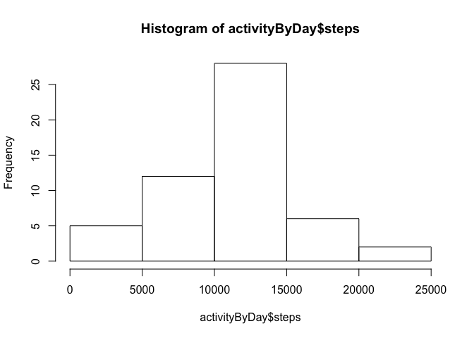
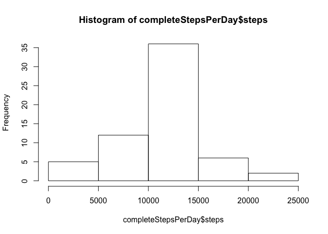

`Author: Joao Felizardo`

Loading and preprocessing the data
----------------------------------


```r
unzip("activity.zip", exdir = ".")
activity <- read.csv("activity.csv")
```


* Process/transform the data (if necessary) into a format suitable for your analysis

```r
activityByDay<-summarise(group_by(activity, date), steps = sum(steps))
```

What is mean total number of steps taken per day?
-------------------------------------------------

* Calculate the total number of steps taken per day

```r
head(activityByDay)
```

```
## # A tibble: 6 x 2
##   date       steps
##   <fct>      <int>
## 1 2012-10-01    NA
## 2 2012-10-02   126
## 3 2012-10-03 11352
## 4 2012-10-04 12116
## 5 2012-10-05 13294
## 6 2012-10-06 15420
```

* Make a histogram of the total number of steps taken each day

```r
hist(activityByDay$steps)
```

<!-- -->

* Calculate and report the **mean** and **median** total number of steps taken 
per day 


```r
meanPerDay <- mean(activityByDay$steps, na.rm = TRUE)
medianPerDay <- median(activityByDay$steps, na.rm = TRUE)
```
- Mean of the total number of steps taken per day: 1.0766189\times 10^{4}
- Median of the total number of steps taken per day: 10765
    
What is the average daily activity pattern?
-------------------------------------------

* Make a time series plot (i.e. type = "l") of the 5-minute interval (x-axis) and the average number of steps taken, averaged across all days (y-axis)


```r
stepPerInterval <- summarise(group_by(activity, interval), steps = mean(steps, na.rm = TRUE))
plot(steps~interval,stepPerInterval,type="l")
```

<!-- -->

* Which 5-minute interval, on average across all the days in the dataset, contains the maximum number of steps? 

```r
maxStepsInterval <- stepPerInterval[which.max(stepPerInterval$steps),]$interval
```

The 5-minute interval with the maximum number of steps is 835.


Imputing missing values
-----------------------

* Calculate and report the total number of missing values in the dataset (i.e. the total number of rows with NAs)

```r
totalMissingValues <- sum(is.na(activity$steps))
```
Total number of rows with missing values is 2304.
  
* Devise a strategy for filling in all of the missing values in the dataset. The strategy does not need to be sophisticated. For example, you could use the mean/median for that day, or the mean for that 5-minute interval, etc.

Let's use a stretagy to fill the NA's with the mean of the steps in each given interval.

* Create a new dataset that is equal to the original dataset but with the missing data filled in.

```r
# Copy dataframe to a new variable
activity2 <- activity
NAs = is.na(activity2)
missingValues <- activity2[NAs,]
# Use here previous variable stepPerInterval
for (interval in missingValues$interval) {
  activity2[NAs & activity2$interval == interval,]$steps = stepPerInterval[stepPerInterval$interval == interval,]$steps 
}
rm(NAs) # Freed memory, variable not needed anymore
rm(missingValues) # Freed memory, variable not needed anymore
```

* Make a histogram of the total number of steps taken each day and Calculate and report the mean and median total number of steps taken per day. Do these values differ from the estimates from the first part of the assignment? What is the impact of imputing missing data on the estimates of the total daily number of steps?


```r
completeStepsPerDay <- summarise(group_by(activity2, date), steps = sum(steps))
hist(completeStepsPerDay$steps)
```

<!-- -->

```r
mean(completeStepsPerDay$steps)
```

```
## [1] 10766.19
```

```r
median(completeStepsPerDay$steps)
```

```
## [1] 10766.19
```

: The **mean** value is the same as the value before because we put the mean value for each particular 5-min interval. The median value shows now the same as the mean, because the previous missing values are now equal to the mean of each specific interval.


Are there differences in activity patterns between weekdays and weekends?
-------------------------------------------------------------------------

* Create a new factor variable in the dataset with two levels – “weekday” and “weekend” indicating whether a given date is a weekday or weekend day.


```r
activity2$dayType = as.factor(
  ifelse(weekdays(as.Date(activity2$date)) %in% c("Saturday", "Sunday"), 
         "weekend", 
         "weekday"
         )
  )
```


* Make a panel plot containing a time series plot (i.e. type = "l") of the 5-minute interval (x-axis) and the average number of steps taken, averaged across all weekday days or weekend days (y-axis). See the README file in the GitHub repository to see an example of what this plot should look like using simulated data.


```r
weekdaysData = activity2[activity2$dayType == "weekday",]
weekendsData = activity2[activity2$dayType == "weekend",]
meanStepsByIntervalWeekdays = summarise(group_by(weekdaysData, interval), steps = mean(steps))
meanStepsByIntervalWeekends = summarise(group_by(weekendsData, interval), steps = mean(steps))

par(mfrow = c(2, 1))

plot(meanStepsByIntervalWeekdays, type = "l", col = "green", main = "Weekdays")
plot(meanStepsByIntervalWeekends, type = "l", col = "red", main = "Weekends")
```

<!-- -->
